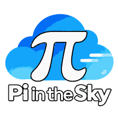

  

# Pi In The Sky (PITS)

Experimental, remote-first durable coding agents built with Pi Durable and Cloudflare.

Development begins with **S0: an execution and recovery feasibility spike**. The initial experiment is intentionally headless and focuses on command deduplication, interruption classification, and workspace checkpoints rather than a UI.

See the S0 implementation branch/PR for details. Do not deploy this experiment with real secrets or untrusted repositories until its isolation and recovery assumptions have been tested.
